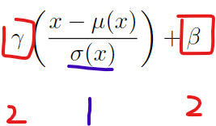
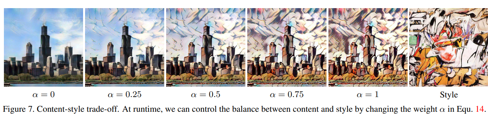

# 论文笔记-《Arbitrary Style Transfer in Real-time with Adaptive Instance Normalization》

## 废话1
事实上, adain已经是一篇非常久远的工作, 网上也能搜索到不少介绍adain的博客. 但写两篇论文阅读报告是我的课程作业, 因此还是重复造一次轮子. 其实本来打算写上stylegan的阅读报告, 看到里面有个adain模块, 想知道起到什么作用, 就看了下这篇文章. 为了看懂这篇论文, 又看了两篇更早期的工作, 那么问题来了, 我为什么不写更早的Perceptual Losses for Real-Time Style Transfer and Super-Resolution, 或者更新的stylegan? ~~(因为更早的工作实在太老了, stylegan比较麻烦[滑稽]).~~ 

因为我非常喜欢adain这篇工作, 它上来先否定掉别人的观点, 抛出自己的观点; 然后设计实验, 证明自己的观点更加合理; 接下来提出本文的方法, 解决目前存在的一个问题; 最后展示本文的工作一些花里胡哨的玩法.

## 废话2
- 1 我的风格迁移初印象

之前并没有接触过什么风格迁移的工作, 开始只记得cs231的作业, 网络是这样的:

损失由两部分组成:

\\[ \mathcal{L}  = \mathcal{L}_{c} + \lambda \mathcal{L}_{s} \\]

输入为内容图像content image(记为c)和风格图像style image, 希望输出的图像既有c的内容, 又有s的风格. 

这里, 我们还需要一个经过预训练的神经网络模型, 认为它能较好的提取图像特征. 固定神经网络的参数, 随机初始化一个图像(记作o), 用神经网络处理这三张图像, 得到三个图像的特征. 希望生成的图像既有c的内容, 又有s的特征. 因此定义了两个损失:$\mathcal{L}_{c}$, 它用来衡量o和c内容上的相似程度, (例如)可以直接计算c和o特征向量的L2距离实现; $\mathcal{L}_{s}$, 它用来衡量o和s风格上的相似程度, 我们先不介绍其具体实现.

得到了o和s的风格相似程度, o和c的内容相似程度, 接下来我们就可以通过梯度下降算法修改o的值, 让风格相似程度, 内容相似程度达到最大.

这种方法的好处是没有训练过程; 可以将任意内容图像和风格图像融合. 缺点是没有训练过程, 极其依赖预训练的模型, 需要梯度下降法迭代的生成图像.

- 2 猛男的快速生成

看论文的时候一脸懵逼, 我印象中的风格迁移压根儿不需要训练, 也可以用于各种风格, 完全不知道论文再说什么. 然后我发现了一篇文章Perceptual Losses for Real-Time Style Transfer and Super-Resolution, 我搜索的时候已经近8000引用了. 首先注意到作者有一个李飞飞, 仔细一看, woc, 一作不是在cs231给我们上课的justin johnson小哥吗? ~~(感觉他一拳能给我打死)~~ 

说来惭愧, 我都忘了他介绍过他的工作. 他的模型长这个样子:

同样的输入, 同样的输出, 里面x和$y_c$是一个东西. 添加了一个image transform net, 一步到位将内容图像变成输出图像. 然和和上面的工作同样, 根据输出图像, 内容图像, 风格图像计算损失更新网络. 

相信大家已经注意到, 仅仅使用内容图像生成输出, 风格图像: 那。。。我走? 实际上, 风格图像的信息蕴含在image transform net(以下记为itn)的参数中, 因此有几个风格就要训练几个itn. 这种方法的优点是训练了专门用于风格迁移的神经网络, 可以得到质量更好的图像; 一步到~~胃~~位, 不需要迭代地生成一张图像. 缺点是每种风格都要训练一个网络.

而本文的adain正是为了解决这个缺点. adain用一句话概括就是:风格就是均值和方差. 

## 神奇的Instance Normalization

众所周知, batch normalization是人类的老朋友, 也被用于早期的风格迁移网络. 其公式长这个样子:

\[ \mathrm{BN}(x)=\gamma\left(\frac{x-\mu(x)}{\sigma(x)}\right)+\beta \]
\[ \mu_{c}(x)=\frac{1}{N H W} \sum_{n=1}^{N} \sum_{h=1}^{H} \sum_{w=1}^{W} x_{n c h w} \]
\[ \sigma_{c}(x)=\sqrt{\frac{1}{N H W} \sum_{n=1}^{N} \sum_{h=1}^{H} \sum_{w=1}^{W}\left(x_{n c h w}-\mu_{c}(x)\right)^{2}+\epsilon} \]

batch norm在整个批次的N张图像上计算均值和方差. Ulyanov提出将其修改为Instance Normalization, 即在一张图像上计算均值和方差, 而不是在一个批次的N张图像中. 即:

\[ \operatorname{IN}(x)=\gamma\left(\frac{x-\mu(x)}{\sigma(x)}\right)+\beta \]
\[ \mu_{n c}(x)=\frac{1}{H W} \sum_{h=1}^{H} \sum_{w=1}^{W} x_{n c h w}\]
\[ \sigma_{n c}(x)=\sqrt{\frac{1}{H W} \sum_{h=1}^{H} \sum_{w=1}^{W}\left(x_{n c h w}-\mu_{n c}(x)\right)^{2}+\epsilon} \]

这是代码的一小步, 确实性能提升的一大步. 为什么instance norm有这么好的效果?

## Instance Normalization的作用-Ulyanov的观点

老实说, Ulyanov的观点我并没有看懂, 这里只是猜测他的观点. goto label1 ; 

Ulyanov在原文中写道: Intuitively, the normalization process allows to remove instance-specific contrast information from the content image, which simplifies generation.

后来他在续作中写道: A simple observation that may make learning simpler is that the result of stylization should not, in general, depend on the contrast of the content image but rather should match the contrast of the texture that is being applied to it. Thus, the generator network should discard contrast information in the content image x0. We argue that learning to discard contrast information by using standard CNN building block is unnecessarily difficult, and is best done by adding a suitable layer to the architecture

本文的作者写道:  Ulyanov attribute the success of IN to its invariance to the contrast of the content image.

(看不懂不用翻原文了, 这就是3篇文章中对Ulyanov观点的所有介绍)

label1:

我的理解, Ulyanov认为instance norm将所有图像调整成了相同的对比度(方差). 例如下面两张图:

左边图像比较灰暗, 像素的方差较小, 图像的对比度较小; 右侧的图像花里胡哨, 像素的方差较大, 图像的对比度较大. Ulyanov认为instance norm将其调整成相同的对比度(方差). 进一步的, 模型的输入图像更为单一, 不会让愚笨的神经网络处理各种复杂的输入图像. 

简而言之, 毛先生U认为是方差在起作用. 但本文的作者认为起作用的是$\gamma , \beta$. 为了推翻U的观点, 作者进行一组实验, (we then normalize all the training images to the same contrast by performing histogram equalization on the luminance channel,)我理解为对图像进行预处理, 让图像有相同的对比度. 进行训练得到b图. 和未经预处理的a图进行对比, 可以看到instance norm仍然明显表现更好. 说明instance norm不仅仅是设置相同对比度.(c图稍后介绍)

## Instance Normalization的作用-作者的观点

随后作者提出自己的观点, 起作用的是$\gamma , \beta$. 更具体的, $\mu , \sigma$是老的均值方差, 是老的风格, 而$\gamma , \beta$是新的方差均值, 是新的风格. 

当使用Johnson的框架训练特定风格的神经网咯时, 为什么Instance Norm效果更好? 因为使用Instance Norm, 一个批次N张图像中, 每张图像都有相同的均值和方差, 即每张图像都有相同的风格; 而如果使用batch norm, 均值方差是在N张图像上计算的, 这将导致经过归一化后, 每张图像都有不同的均值方差, 进而每张图像都有不同的风格, 寄.

随后作者进行了一个实验. 首先用先前的方法, 将训练集全部转换为风格1的图像. 然后训练这些图像转换为风格2的图像. 因为所有图像都是风格1, 因此所有图像有相同的均值方差, 进而无论是在一个图像还是N张图像上, 都会计算出相同的均值方差, 进而batch norm和instance norm算出的$\mu , \sigma$是相同的, 两个层也近似是相同的. 于是作者预测此时两种操作应该得到相近的效果, 而上图中的c图印证了作者的猜想. 

实际上, 在这篇工作之前, 大家已经注意到了风格就是均值和方差, 例如已有工作用均值方差衡量两张图像风格的差异; 甚至论文A LEARNED REPRESENTATION FOR ARTISTIC STYLE通过修改$\gamma , \beta$生成不同风格的图像. 本文主要解释instance norm的作用, 并进一步地生成任意风格的图像.

## 模型

本文的模型如下所示:

一些记号:
c内容图像, s风格图像, f VGG编码器, g VGG解码器, $\phi_i$ VGG的一个层

adain为:

\[\operatorname{AdaIN}(x, y)=\sigma(y)\left(\frac{x-\mu(x)}{\sigma(x)}\right)+\mu(y)\]

- 首先使用第一个VGG将内容图像和参考图像降维, 得到高级特征f(c)和f(s). 
- 经过一个adain层, f(c)的均值方差被调整为f(s)的均值方差, 这意味着其输出(记为t)有了风格图像的风格. 
\[ t=\operatorname{AdaIN}(f(c), f(s))\]
- 然后通过一个解码器, 将高级的图像特征还原为rgb图像, 
\[T=g(t)\]
- 随后和Johnson的工作相同, 用得到的图像, 计算和内容图像在内容上的相似程度, 和风格图像在风格上的相似程度, (通过第二个VGG计算损失)得到损失完成训练.

其中内容损失为:
\[\mathcal{L}_{c}=\|f(T)-t\|_{2}\]
注意和之前的工作不同, 作者用的是修改后风格的t, 而不是像之前的工作计算$\|f(T)-f(c)\|_{2}$. 作者给的解释是这样训练更快. 个人认为这种操作还是比较激进的, 没有证明adain操作不会改变内容.

然后是风格损失, 既然作者认为风格就是均值和方差:

\[
\mathcal{L}_{s}=\sum_{i=1}^{L}\left\|\mu\left(\phi_{i}(T)\right)-\mu\left(\phi_{i}(s)\right)\right\|_{2}+ \\
\sum_{i=1}^{L}\left\|\sigma\left(\phi_{i}(T)\right)-\sigma\left(\phi_{i}(s)\right)\right\|_{2}
\]

另外值得一提, 解码器中没有用任何norm层, 因为这会改变均值方差, 进而影响风格. 实验部分对此进行了消融实验.

## 实验
- 效果: 实际上, 该模型的效果不如其他模型. 毕竟其他模型都是逮着一个风格死命训练, 一个风格一个模型, 而本文可迁移到任意模型. 但也不会差太多. 效果图就不再展示. 

- 消融实验分为两部分, 其一为在解码器中使用norm层会使结果更差; 其二为修改adain层, 直接将f(c),f(s)连接在一起输入到解码器中. 这种设置下相似程度稍增, 但内容相似程度大跌. 具体见原图6 ~~(贴出来你们也得花好一会儿观察, 不如不放)~~

## 玩法

- 迁移了, 但没完全迁移: 修改了均值方差, 但没完全修改
\[T(c, s, \alpha)=g((1-\alpha) f(c)+\alpha \operatorname{AdaIN}(f(c), f(s)))\]

- 风格的组合: 特征的线性组合
\[T\left(c, s_{1,2, \ldots K}, w_{1,2, \ldots K}\right)=g\left(\sum_{k=1}^{K} w_{k} \operatorname{AdaIN}\left(f(c), f\left(s_{k}\right)\right)\right)\]

- Color control: 没看懂

- 一副内容图像用多幅风格图像修改: 给定一个区域, 用一个风格的均值方差修改该区域的像素. 例如该图中, 人物和背景用不同的风格修改.

