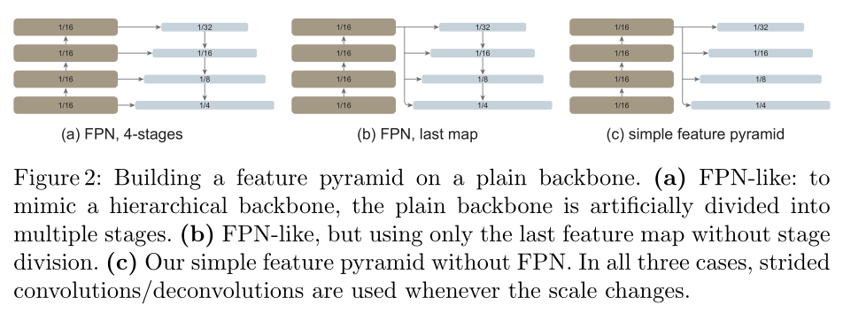
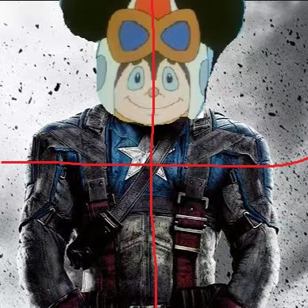
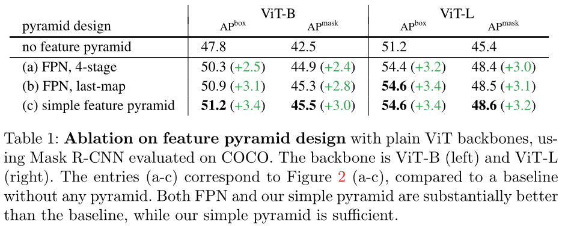
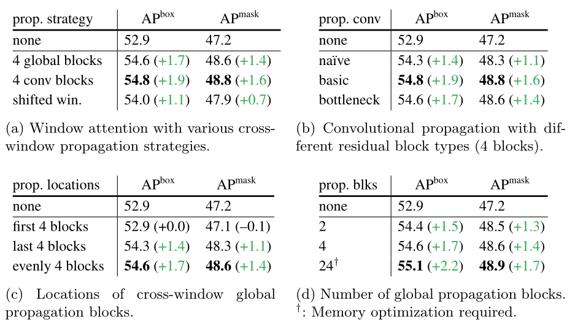
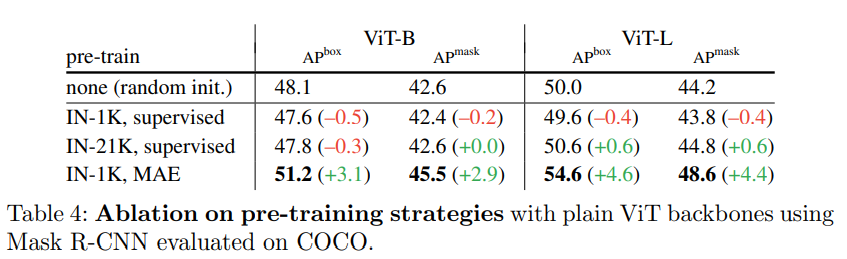
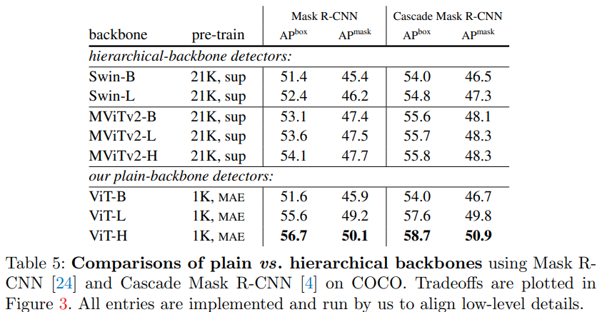
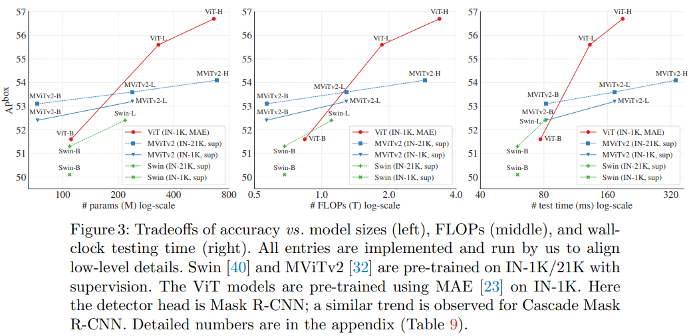
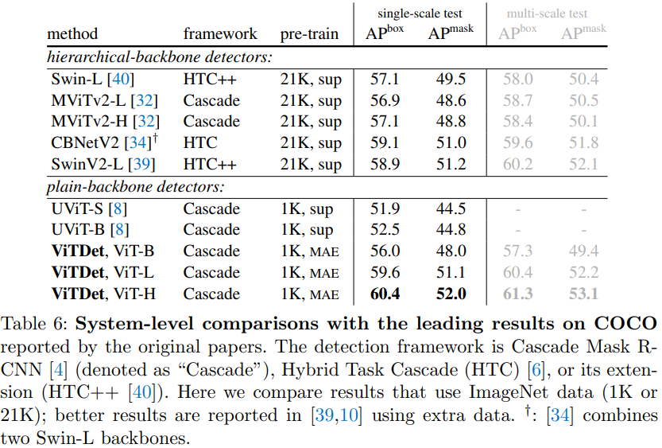

# Exploring Plain Vision Transformer Backbones for Object Detection

Li Y, Mao H, Girshick R, et al. Exploring plain vision transformer backbones for object detection[J]. arXiv preprint arXiv:2203.16527, 2022.

## 背景和问题

以往的目标检测往往需要backbone输出不同尺度的特征, 例如输入224\*224的图像, 经过backbone, 输出若干张不同下采样的特征图——7\*7, 14\*14, 28\*28, 56\*56(32倍, 16倍, 8倍, 4倍下采样)。大尺寸的特征图更适合检测一些低级的概念、较小的物体, 小尺寸的特征特更适合检测抽象的概念、较大的物体。

后来transformer横空出世, 大佬另起炉灶, 用注意力机制做出了另一个系列的backbone. 其中最火的应该莫过于vit了, ~~因为它最简单。~~ 但是vit有一个问题, vit的特征图尺寸是不变的, 本文中, vit只能产生16倍下采样的特征图, 并不能直接输出特征金字塔, 用于目标检测或分割任务. 事实上, 该家族中有swin等模型可以产生多尺度的特征. 但vit毕竟是注意力机制家族中的老大哥, 用他来进行预训练消耗了不少人力物力, 到最后只能做个分类任务(以及检索等), 多少有点遗憾.

除此之外, 预训练和下游任务的尺寸往往不同. 例如本文中, 预训练和下游任务图像的尺寸分别为224\*224, 1024\*1024, 如何使用预训练模型也是一个需要考虑的问题.

本文研究的是:
- 如何使用vit的16倍下采样特征, 生成特征金字塔, 用于目标检测任务.

- 如何将预训练模型用于尺寸不同的下游任务.

## 方法

如何解决上面提到的问题, 作者提出了一系列方法, 通过实验比较方法的优劣. 首先是第一个问题, 如何生成特征金字塔, 作者实验了3种方法:

- 我们从(c)开始看, 这是本文默认的方法. 左侧是vit, 分为4个阶段. 作者只使用最后一层的特征(16倍下采样), 对其进行pooling操作得到32倍下采样特征图, 分别使用1次, 2次反卷积, 得到8倍, 4倍下采样特征图. 

- 在(b)中, 作者不仅仅使用vit最后一层的输出, 还使用更小分辨率的特征图, 构建更大尺寸的特征图. 

- 在(a)中, 作者不再仅仅使用了vit最后一层的输出, 用浅层的vit block特征, 构建大尺寸、包含低级语义信息的特征图; 还包含了一个从上到下的分支, 将高级语义信息传递到大尺寸的特征图中. 

经过实验, (c)的效果最好.

然后是第二个问题, 下游任务的图像尺寸太大, 作者使用了swin中的方法, 将图像分为若干个窗口, 在窗口内进行注意力机制的计算:

其实就是swin中的在窗口内算注意力, 去除了swin中的patch merging操作, 修改了swin中的窗口移动操作, ~~(不然不就成swin的子集了, 滑稽)~~。窗口移动的目的是, 让每个窗口中的像素, 可以"看到"全局的信息. 作者提出了两种替代方案:

- 作者将整体的vit分成了4个阶段, 将每个阶段的最后一个注意力层中, 窗口的注意力改成全局注意力.

- 同样vit分成4个阶段. 在每个阶段结束时, 添加一个卷积层. 这样一个窗口边缘的像素, 能把信息传递到其他窗口中.

经过实验, 后者效果更好.

## 实验

### 多尺度特征

(c)取得了最好的结果. 作者给了一种解释:
- 最初的 FPN 的动机是将较低分辨率、更强的特征图与更高分辨率、更弱的特征图相结合。当骨干是平原且没有高分辨率地图时，这个基础就会丢失，这可以解释为什么我们的简单金字塔就足够了。

作者提出对指标有帮助的, 是产生多尺度的特征, 而不是让信息从低分辨率特征图传递到高分辨率特征图中. 作者尝试直接反卷积得到4倍下采样特征图, 从中下采样, 得到8倍, 16倍, 32倍下采样特征图, 同样取得了较好的效果. 

### 看到全局

作者比较了提出的两种方法和swin中的移动窗口三种策略的效果, 结果见(a)图, 可见使用卷积层效果最好.

除此之外, 还有一些不那么重要的结果:

- (b)的结果显示, 越复杂的卷积网络可以得到越好的效果

- (c)的实验为, 不再均匀地分成4个阶段, 而是在最开始的4个块, 或者最后的4个块, 进行"看到全局"的操作, 与标准的均匀分布进行比较.

- (d)的实验为, 分成2个或者24个阶段的效果. 虽然最后一项在每个block都进行操作可以得到最好的结果, 但计算量太大, 令人难以接受.

### 预训练方法

#### 分类 vs 重建

默认配置中使用MAE方法预训练的vit. 可以看到, 即使IN-21K数据集的图像是IN-1K数据集的十余倍, 在后者上的MAE预训练模型还是取得了更好的效果. 

可以理解为分类任务较为简单, 而MAE中的图像重建较为困难, 和目标检测一样同为密集预测型任务. 使用VAE可以训练出更强大的模型.

#### VAE vs 其他预训练模型

作者和swin, MViTv2进行对比, 他们均可输出多尺度特征. 可以看到本文的模型明显优于这两个模型. 个人认为有两个原因:

- swin, MViTv2使用监督学习的方法进行预训练. 本文已经通过实验证明, 图像重建任务更有挑战性, 对目标检测帮助更大.

- vit有更高的计算复杂度, 更慢的推理时间. 如上图, 可以看到检测性能, 计算量, 运算时间有着相同的变化趋势. 可以理解为vit用更多的计算换来了更好的性能.

### 与其他系统的比较

作者在COCO数据集和LVIS数据集上和一些先前的模型进行比较(ViTDet为本文模型). 结果见上图. 可以看到, vit作为backbone, 可以取得和hierarchical backbone同样优秀的结果.

